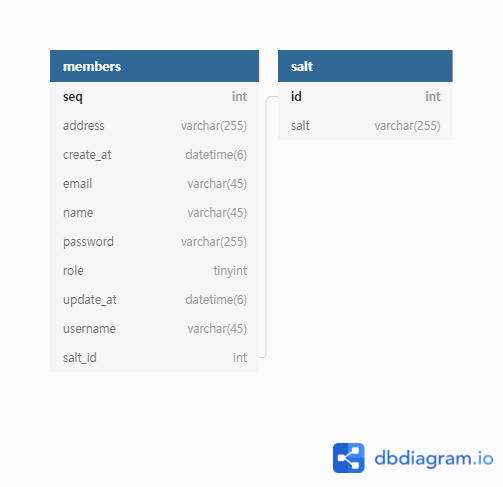
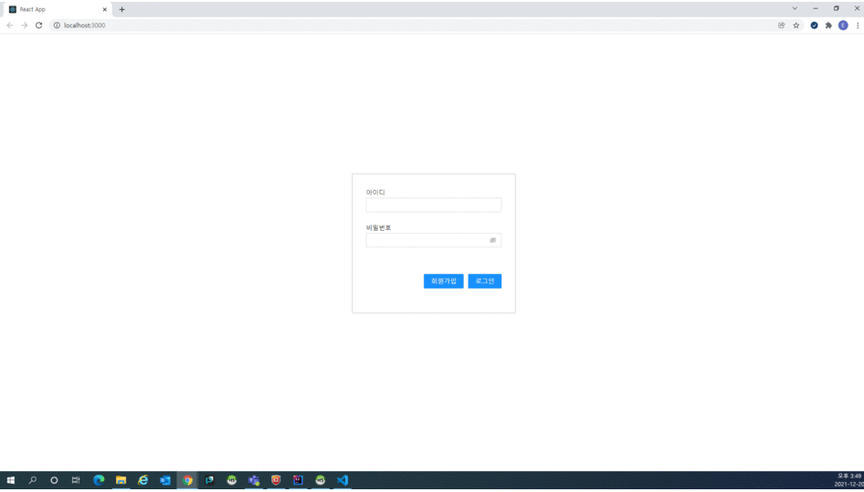
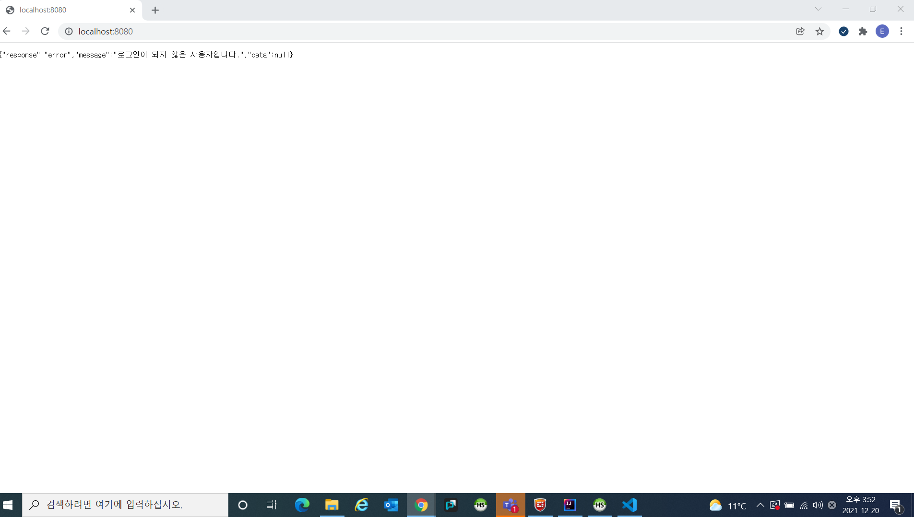
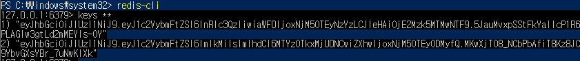
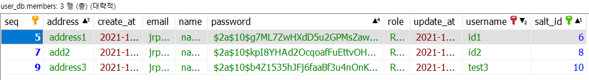
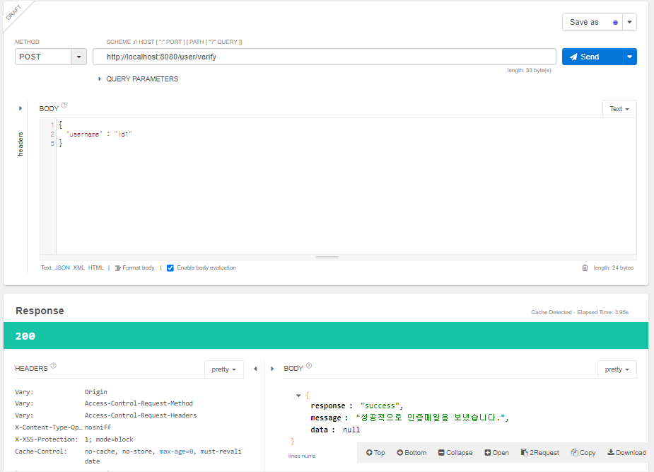
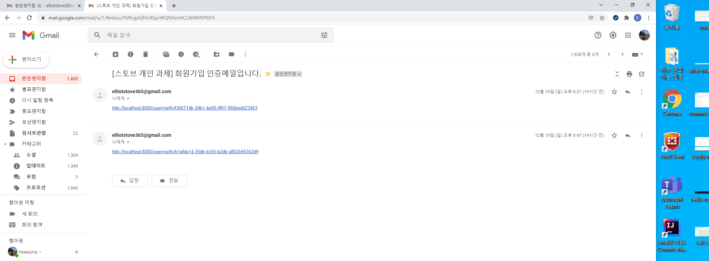
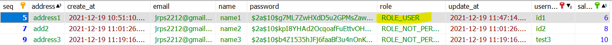
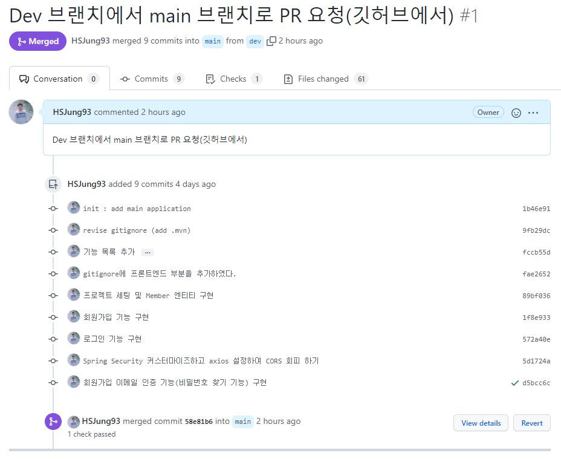

# Spring으로 구현하는 Auth Server

## 아키텍처

## ERD

## 시나리오

1. 회원가입 및 로그인 화면

2. 백엔드
* 백엔드 인증 서버는 프론트엔드로 response를 반환(존재하지 않는 아이디)

* 레디스에 토큰과 만기 저장

* 사용자 DB에 유저 정보 저장

* salt DB에 각 유저별 salt 정보 저장

3. 이메일 인증으로 유저 권한 변경
* 이메일 api 테스팅

* 메일 확인

* 유저 권한 변경

## 프로젝트 세팅
* 프론트 엔드
    * node v16.13.1
    * yarn 1.22.17
    * typescript
    * react
    * package.json과 tsconfig 세팅
* 백 엔드
    * java 1.8
    * spring-boot
    * pom.xml에 dependency 세팅

## 기능 목록
* 커밋 히스토리

* 회원가입 기능 구현
    * Member 모델, 레포지토리 구현
    * AuthService, AuthServiceImpl 구현
    * MemberController 컨트롤러에 signUp 메소드 구현
* 회원가입 화면 구현
    * SignUpContainer와 SignUpPresenter 구현
* 시간차 JWT를 사용한 로그인 기능 구현
    * JwtUtil, CookieUtil 서비스 구현
    * MemberController 컨트롤러에 login 메소드 추가
    * RedisUtil 서비스 구현
* 로그인 화면 구현
    * MainContainer와 MainPresenter 구현
* Spring Security 커스터마이즈하고 axios 설정하여 CORS 회피 하기
    * 프론트 엔드: Endpoint와 axios 설정
    * 백 엔드: JwtRequestFilter 구현
* 회원가입 이메일 인증 기능(비밀번호 찾기 기능) 구현
    * RequestVerityEmail 모델 구현
    * EmailService, EmailServiceImpl 구현
* TODO: 
    * [x] DB의 경우 디폴트 값으로 먼저 구현했으나, 추후 조건에 맞게 DB 변경해볼 것(예, varchar(255)에서 varchar(45) tinyint로)
    * 사용자 역할 설정하는 admin 페이지 구현
        * [x] AdminController 구현
        * [ ] admin 화면 구현(타임 리프)
    * [ ] Enum UserRole에 속성을 더하여 UserRole별 db에 저장될 tinyint 값 구현
 
## 회고
* React를 사용해본 것은 좋으나, React를 공부하느라 백엔드에서 추가적으로 구현해 볼 수 있는 것들을 놓침(ex. nginx)
* React 프론트 구현이 완벽하지 않음(ex. db 설정에 맞는 글자 수 제한 등)